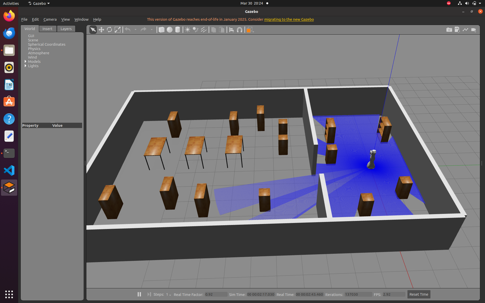
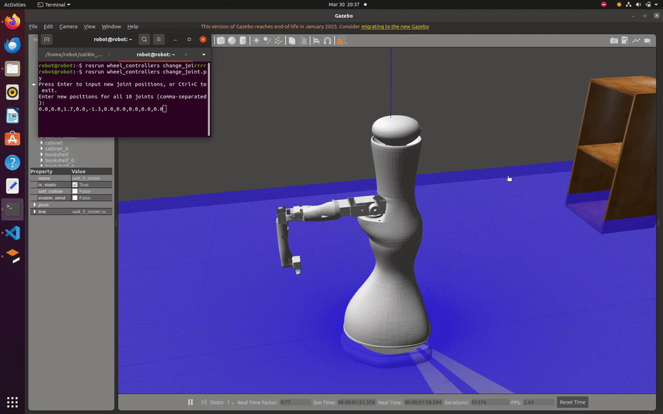
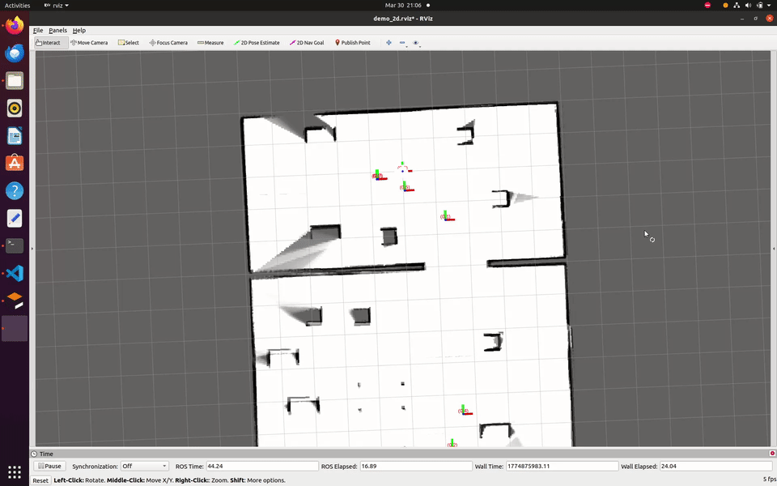

# Cartographer + Gazebo Mapping & Localization Guide

This guide explains how to:

* Build workspace with `catkin_make_isolated`
* Spawn robot in Gazebo
* Control robot & arm
* Create a map using Cartographer
* Save `.pbstream`
* Convert `.pbstream` to ROS map
* Run localization and navigation

---

## 1. Build Workspace (catkin_make_isolated)

Since `cartographer_ros` uses **catkin_make_isolated**, the entire workspace must also use it.

After **any change** (config, launch file, or code):

```bash
catkin_ws_isolated --install
```

> If you do **not** want to use `catkin_make_isolated`, you must split `cartographer_ros` into a separate workspace.

---

## 2. Launch Gazebo Simulation

Start Gazebo with your robot:

```bash
roslaunch my_robot_gazebo spawn_robot.launch
```

### Expected Result

Robot should appear in the Gazebo world.



---

## 3. Manually Control Robot Arm

Run:

```bash
rosrun wheel_controllers change_joint.py 
```

Example joint values:

```
0.0,0.0,1.7,0.0,-1.3,0.0,0.0,0.0,0.0,0.0
```

### Expected Result

Robot arm moves to the configured pose.



---

## 4. Create Map using Cartographer

Start robot teleoperation and mapping:

```bash
# Start teleoperation (keyboard control)
rosrun wheel_controllers cmd_vel_remote.py

# Launch robot and Cartographer for 2D mapping
roslaunch wheel_controllers backpack_2d.launch
```


**Notes:**

* Drive slowly and steadily for better map quality.
* Cover all areas that need to be mapped.

---

## 5. Save Cartographer Map (.pbstream)

After mapping finishes, save the map:

```bash
rosservice call /write_state "{filename: '$HOME/catkin_ws_base/src/maps/my_map.pbstream', include_unfinished_submaps: true}"
```

This creates:

```
my_map.pbstream
```

---

## 6. Convert `.pbstream` → ROS Map

```bash
rosrun cartographer_ros cartographer_pbstream_to_ros_map \
  -pbstream_filename $HOME/catkin_ws_base/src/maps/my_map.pbstream \
  -map_filestem $HOME/catkin_ws_base/src/maps/my_map
```

This generates:

```
my_map.pgm
my_map.yaml
```

Mapping is now complete.

---

## 7. Run Localization

Launch localization:

```bash
roslaunch wheel_controllers demo_backpack_2d_localization.launch
```

### 8. Set Initial Pose in RViz

Manually set robot initial pose:

1. Open RViz → **2D Pose Estimate**
2. Click on the map to set pose



Robot should now localize correctly.

---

## 9. Navigation

Launch move_base:

```bash
roslaunch wheel_controllers move_base.launch
```

### Navigation Tuning

To achieve better path planning, adjust parameters in:

```
~src/wheel_controllers/param/costmap_common_params.yaml
```

Example:

```yaml
inflation_radius: 1          # Obstacle inflation
cost_scaling_factor: 10.0    # How fast cost decreases away from obstacles
```


---
